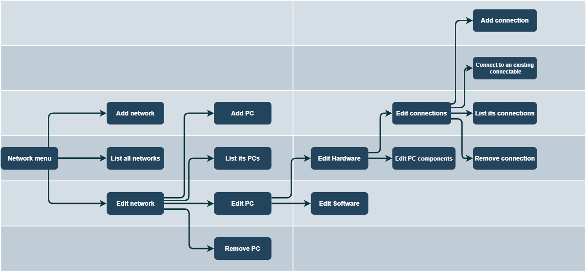

# LAN simulator
First stage of a Java Maven OOP project that simulates the flow of a Local Area Network (LAN).

***Project logic***:
- Networks have multiple computers
- Computers have a hardware component and a software component
- Hardware consists of physical connections (printers and switches) and computer components (graphics cards and network adapters).

> Software is yet to be implemented
> 
> Relations between computers are yet to be implemented
> 
> Networking functions such as pinging from a Host to another are yet to be implemented

***User story diagram:***

